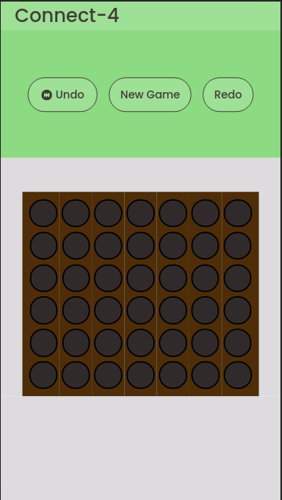

# About Connect-4

This project was to experiment with some ideas, it is to be a fun rendition of a classic.

# Demo

https://bamboo-foo.github.io/connect-4/

# Tech Stack

This was built with JS, CSS and HTMl.  It is a mobile first design.

# Experimental

It experiments with an idea where state is seperated from objects and hosted at a central repository.  Inspiration: https://day8.github.io/re-frame/application-state/#the-benefits

## To Do:

- [ ] Responsive design
- [ ] Enhance readability
- [ ] Refine MVC architecture 
- [ ] Increase accessibility with better button demarcation and style
- [ ] Add chip to let user know who's turn it is
