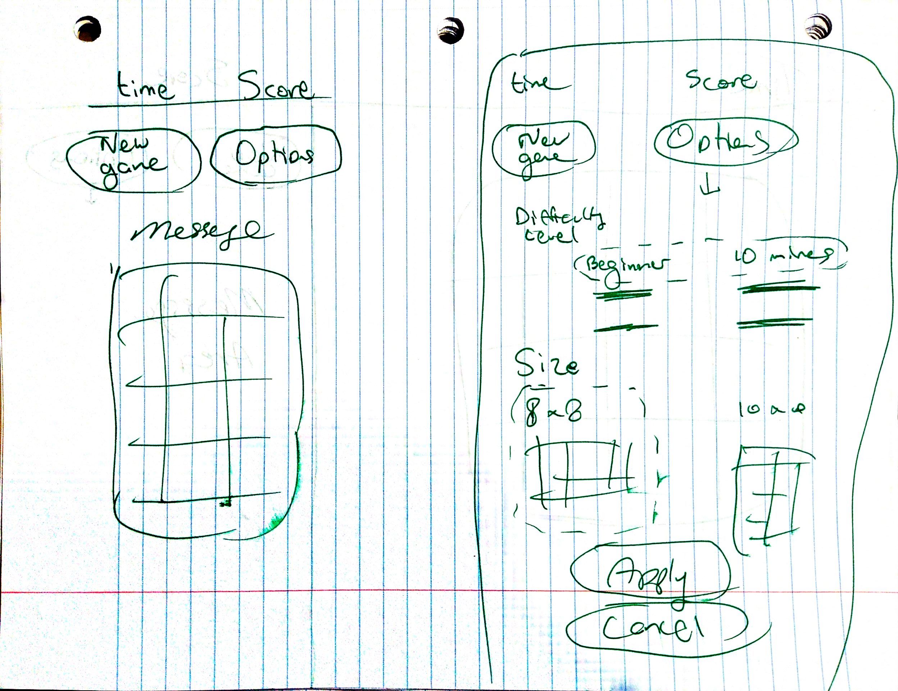
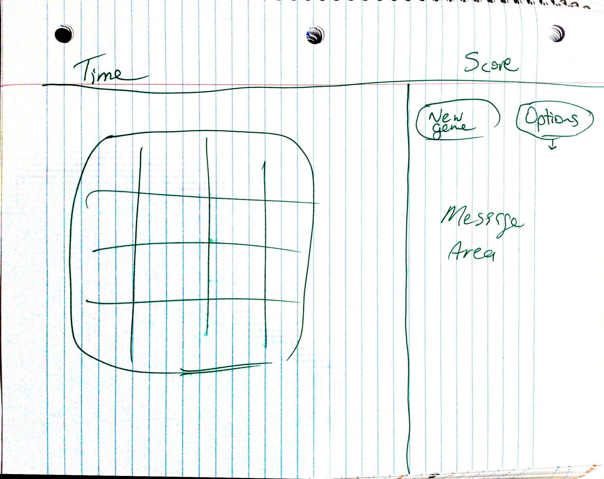

# Planning for Minesweeper

# Classic Minesweeper

# Wireframes

## For Mobile

## For Desktop

# Pseudocode

## 1 - Setup
- Have default settings for difficulty, and board size
- If at any time user hit apply initialize board
- Render default board

---
##  2 - Initialize
- Have a random number
- Listen for click on board
- After first click board the board will then have mines (so as not to lose on first click)
- Start timer

---
## 3 - Look for mines, hints, and open 
- Check cells under click for mine
- Check cells around click
- Open board until borders or hint cells
- If all cleared declare win

## To Do:
Consider how to let user flag mines and where to put in logic, (probably under section 3)
